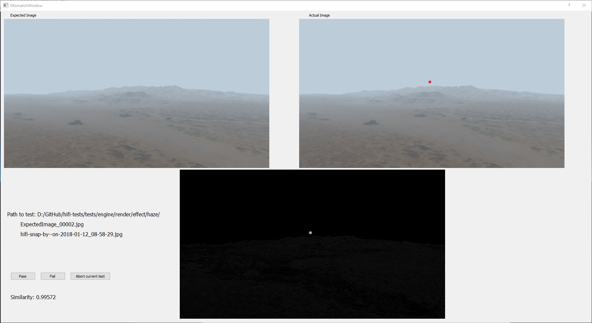

# Auto Tester

The auto-tester is a stand alone application that provides a mechanism for regression testing.  The general idea is simple:
* Each test folder has a script that produces a set of snapshots.
* The snapshots are compared to a 'canonical' set of images that have been produced beforehand.

***Please note that before running any tests that the avatar must be in an empty part of the domain.***

## autoTester.js
A utility script in the **tests/utils** folder is **autoTester.js**.  During a test, this script is pulled from the GitHub repository.

This script is a module that exposes two functions.
### setupTests.js
This function hides the avatar, sets its orientation to 0, sets the snapshots folder and sets up the secondary camera.  The secondary camera is used to take snapshots so that the snapshot size will be independent of the user's monitor.  This secondary camera is the function return value.
### runTests
This function runs the tests in either of 2 modes:
1. Manual - the space bar is used to sequence through the steps.  The steps are displayed in the log.
2. Automatic - the steps are sequenced through automatically, at a rate of one per two seconds.  This mode creates a series of snapshots.
## Setup
### Windows 10
* Clone the hifi_tests repository
```
git clone https://github.com/NissimHadar/hifi_tests.git
```
* Double click **setup.bat** to download and install autotester (Note: do not select setup.ps1 by mistake). When prompted, select folder to install autoTester (the default is usually OK).
* 

The executable is located in the **autoTester/Release** folder, and is named **autoTester.exe**.
## Test Folder Content
Each test is in a separate folder, which should contain the following file:
1. test.js - a module containing the test.  The contents are described in detail below.
2. runAuto.js - runs the test.js script automatically, creating a set of snapshots.
3. runManual.js - runs the test.js step by step.
## Test File Content
### test.js
An automatic test is always named **test.js**.  This file contains a javascript module, as described below.  
#### test.js details
The **test.js** file itself has two requirements:
1. Export a parameterless function named `test`
2. Export a boolean named`complete`
    1. Initialized to false
    2. Set to true on completion of the test
    
In addition, the test hierarchy, only the test root may, and must, be named **tests**.  This is because the test needs to find the **tests/utils** folder.
    
A test expects an empty world and should end with an empty world, for the next test (if any).  The test should create a list of snapshots in the local folder.  The following code snippet describes one way of doing this.

```javascript
module.exports.complete = false;

module.exports.test = function (testType) {
    var TESTS_URL = "https://github.com/NissimHadar/hifi_tests/blob/NissimHadar/tests/";
    var SUFFIX = "?raw=true";
    var autoTester = Script.require(TESTS_URL + "utils/autoTester.js" + SUFFIX);
    var spectatorCameraConfig = autoTester.setupTests(Script.resolvePath("."));

    // Create the zone centered at the avatar position
    var pos = MyAvatar.position;

    // As a 5 meters cube box
    var dim = { x: 5.0, y: 5.0, z: 5.0};

    // Define zone properties
    var properties = {
        lifetime: 60,  
        type: "Zone",  
        name: "test create zone",
        position: pos,
        dimensions: dim,
        keyLight:{"color": {"red":0,"green":255,"blue":0}},
        
        skyboxMode: "enabled",
        skybox:{"color":{"red":0,"green":0,"blue":255}}
    };
    var zone = Entities.addEntity(properties);

    // An array of tests is created.  These may be called via the timing mechanism for auto-testing,
    // or stepped through with the space bar
    var steps = [
        function () {
            spectatorCameraConfig.position = {x: pos.x, y: pos.y + 0.6, z: pos.z};
        },
        
        // Take snapshot
        function () {
        },
        
        // Clean up after test
        function () {
            Entities.deleteEntity(zone);
            module.exports.complete = true;
        }
    ]
    
    var result = autoTester.runTests(testType, steps);
};
```
## Using the auto-tester
The auto-tester provides the following 4 functions:
1. Evaluate a single test
2. Evaluate tests recursively
3. Create a recursive test script
4. Create a test case


Each of the 4 functions asks the user to select a folder.

### Evaluate Test
Evaluating a test is performed after running a **test.js** script to create new snapshots.  After selecting the folder, the images are compared in lexical order.  If the similarity between any image pair does not pass a fixed threshold, the image pair is displayed and the user can select to accept the difference, fail this specific test case, or abort testing.

### Evaluate Tests Recursively
This is a recursive version of the previous function.  Auto-tester will recurse through all folders from the selected folder.  A test will be evaluated if the following is true:
* The folder contains a **test.js** script
* The number of actual and expected snapshots is the same (see Create Test for an explanation)
### Create a recursive test script
Auto-tester will create a script named **allTests.js** that will call all **test.js** scripts found in the folder, and any subfolders.  An example of the script created is:
```
// This is an automatically generated file, created by auto-tester
var test1 = Script.require("file:///D:/GitHub/hifi-tests/tests/content/entity/zone/ambientLightInheritance/test.js");
var test2 = Script.require("file:///D:/GitHub/hifi-tests/tests/content/entity/zone/create/test.js");
var test3 = Script.require("file:///D:/GitHub/hifi-tests/tests/content/entity/zone/createMultipleZones/test.js");

var test1HasNotStarted = true;
var test2HasNotStarted = true;
var test3HasNotStarted = true;

// Check every second if the current test is complete and the next test can be run
var testTimer = Script.setInterval(
    function() {
        if (test1HasNotStarted) {
            test1HasNotStarted = false;
            test1.test();
            print("******started test 1******");
        }

        if (test1.complete && test2HasNotStarted) {
            test2HasNotStarted = false;
            test2.test();
            print("******started test 2******");
        }

        if (test2.complete && test3HasNotStarted) {
            test3HasNotStarted = false;
            test3.test();
            print("******started test 3******");
        }

        if (test3.complete) {
            print("******stopping******");
            Script.stop();
        }

    },

    1000
);

// Stop the timer and clear the module cache
Script.scriptEnding.connect(
    function() {
        Script.clearInterval(testTimer);
        Script.require.cache = {};
    }
);
```
### Create a Test Case
A test case is created after running the test script.  Running the script produces a series of snapshots, named **hifi-snap-by-**_user name_**-on-YYYY-MM-DD_HH-MM-SS.jpg**.  This function simply renames these files to **ExpectedImage_1.jpg**, **ExpectedImage_2.jpg** and so on.  These files can be added to version control as they are a fixed asset of the test.
